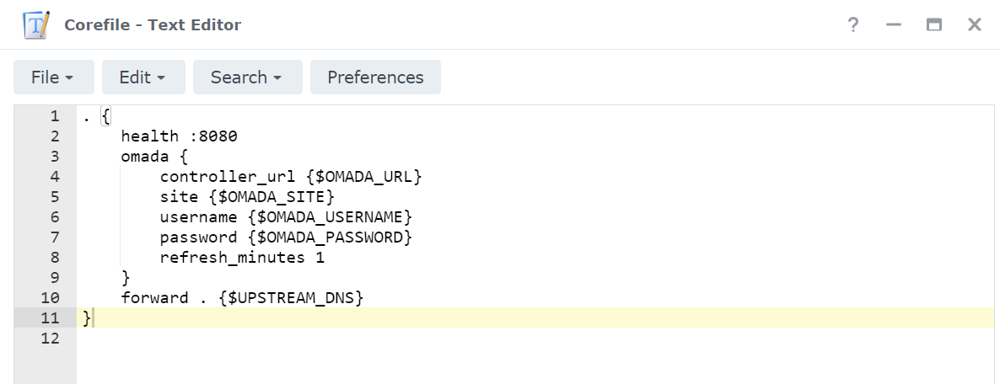
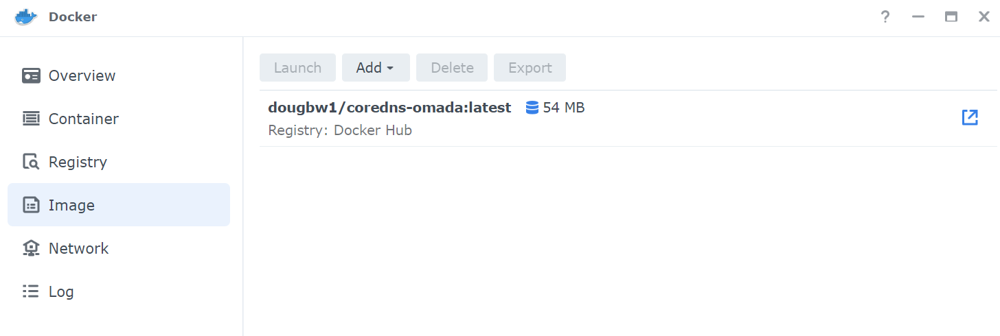
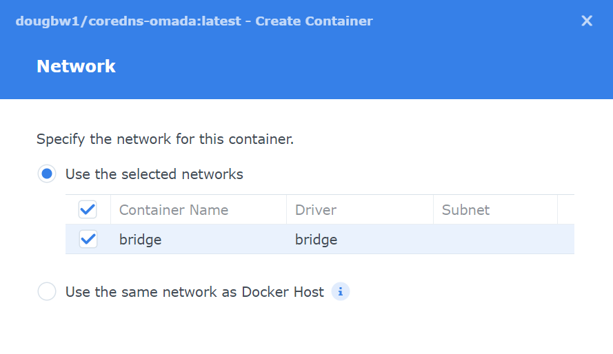
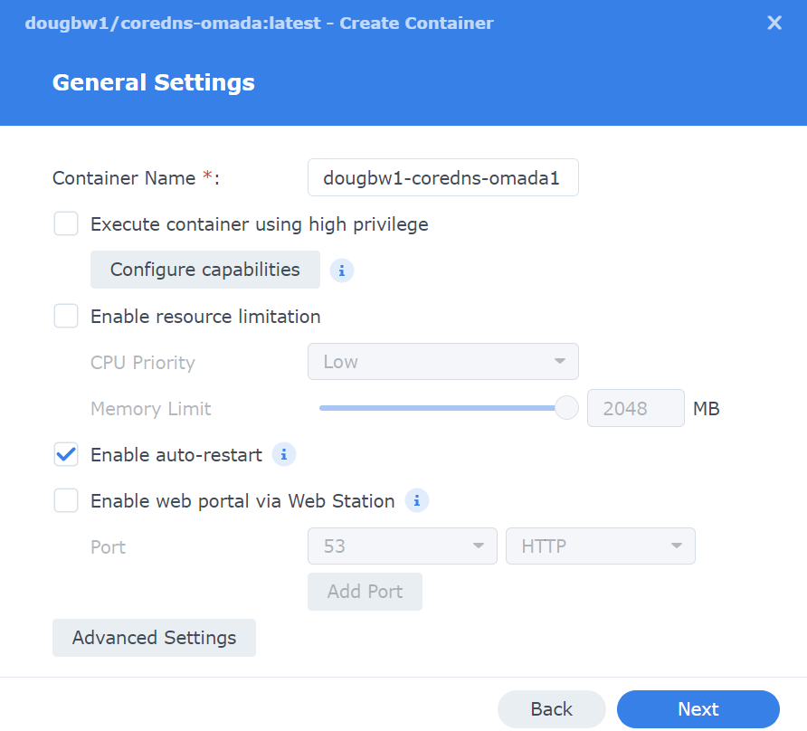
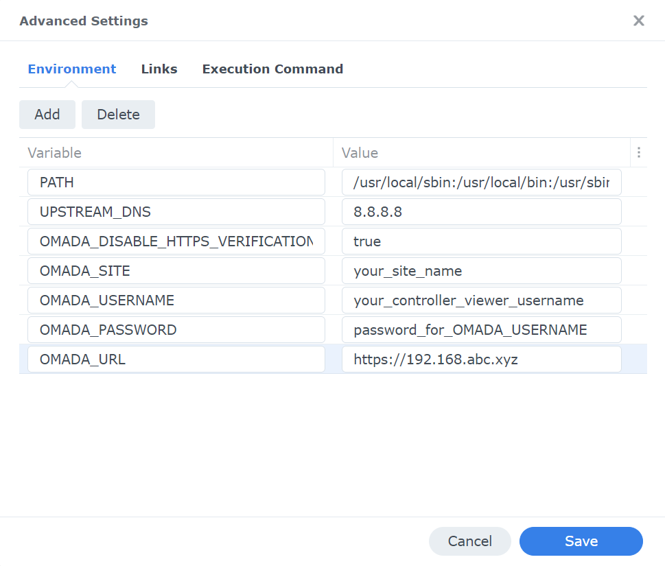
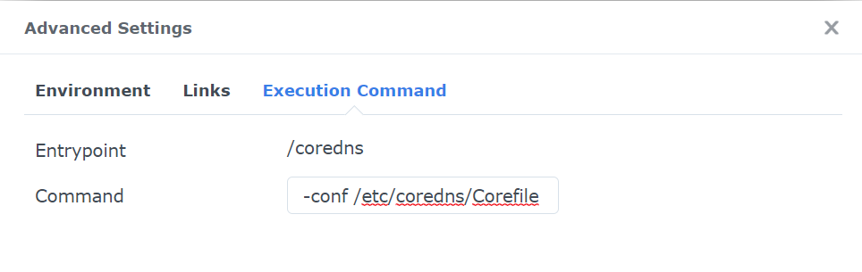
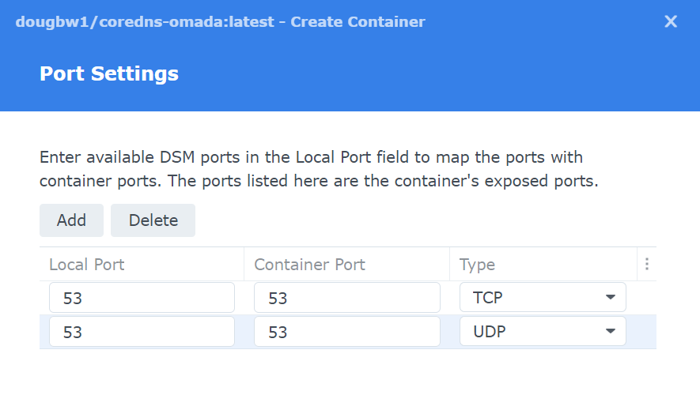

# Synology Docker Instructions

If you want to run coredns-omada on a Synology NAS you have the option of launching the Docker container from the terminal (SSH) with the standard Docker run command. \
However, there are several advantages to creating a container via the Docker plugin in DSM and launching from there. \
To do that, we need fit all the components of this Docker run command into the relevant fields in the DSM Docker plugin:

```
docker run \
--rm -it -m 128m \
--expose=53 --expose=53/udp -p 53:53 -p 53:53/udp \
-v "$PWD"/Corefile:/etc/coredns/Corefile \
--env OMADA_URL="<OMADA_URL>" \
--env OMADA_SITE="<OMADA_SITE>" \
--env OMADA_USERNAME="<OMADA_USERNAME>" \
--env OMADA_PASSWORD="<OMADA_PASSWORD>" \
--env OMADA_DISABLE_HTTPS_VERIFICATION="false" \
--env UPSTREAM_DNS="8.8.8.8" \
ghcr.io/dougbw/corends_omada:latest -conf /etc/coredns/Corefile
```

1. Install `Docker` from the Synology Package Center

2. Open File Station in DSM. \
    You will see a share called `docker` that was created when the Docker plugin was installed.\
    Under that `docker` share, create a folder called `coredns-omada` and upload or create a `Corefile` (as described elsewhere in the documentation for coredns-omada, no modification to the file is necessary for Synology installs).

    - 

3. Open the Docker management console (select it from installed packages in the Package Center) and go to the `Registry` tab.  
	 - Search for the keyword `coredns-omada`
	 - There should be one result that links to https://registry.hub.docker.com/r/ghcr.io/dougbw/corends_omada/
	 - Double click that Image to install and choose `Tag` = `Latest` when prompted. 
	 - The coredns-omada image should now be available on the Image tab of the Docker management console.

     - 

4. Double click the coredns-omada Image to create a Docker Container
    - Select the `bridge` network from the Network pane, click Next.
    - 
    - On the General Settings pane
        - Set the Container Name to whatever you want, default value is fine.
        - Enable auto restart
        - You can set system resource limitations if you wish
        - 
        - Click the Advanced Settings button
            - On the Environment tab, add an environment variable corresponding to each of the `--env` flags in the `docker run` command above. 
                - Environment variable values should not be surrounded by quotes. 
                - The IP address for the controller should be preceded by `https://`
            - Your Environment Variables screen should look like this once complete:
            - 
            - On the Execution Command tab you'll see that the entrypoint for the Container is already set to `/coredns` and you should add `-conf /etc/coredns/Corefile` to the Command textbox \
            This `Corefile` is the file that you added to the `docker` share instep #2 above and you will map the file to `/etc/coredns/Corefile` in a subsequent step. 
            - 
            - Save the Advanced Settings and click next on the General Settings pane.
            
	   
    - On the Port Settings pane you must change the Local ports from Auto to 53 for both TCP and UDP.
    - 
    - On the next pane, Volume Settings, click "Add File" and select the `Corefile` you created under the docker share above. Set the Mount Path to `/etc/coredns/Corefile`
    - Save everything and launch the newly created Container.
