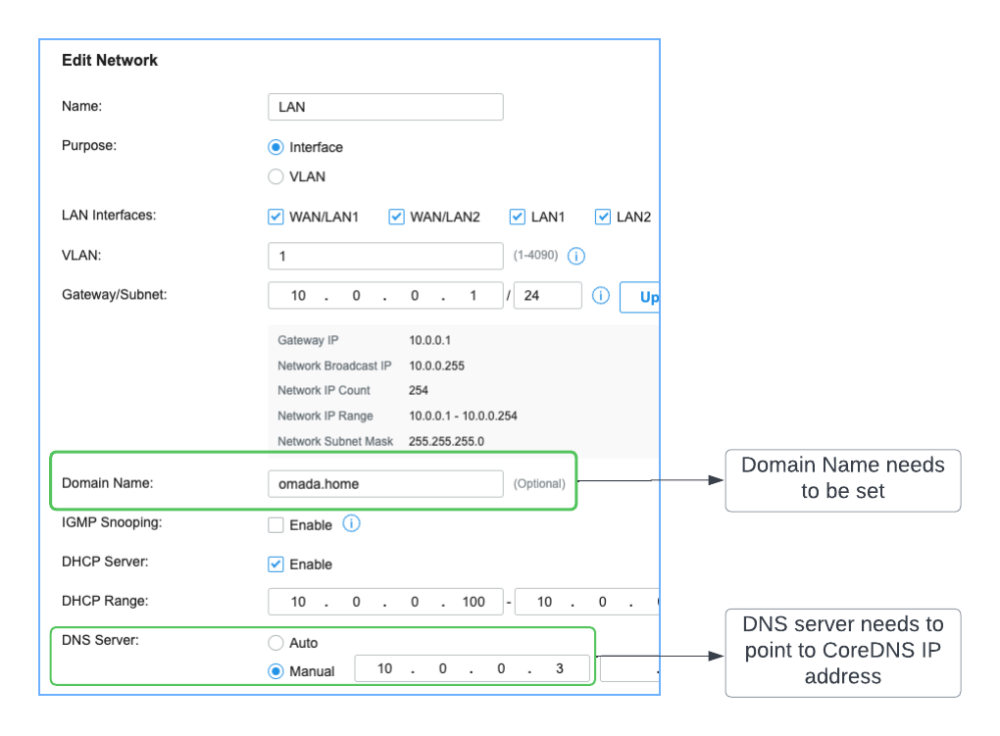

# Getting started

CoreDNS plugins need to be compiled into CoreDNS, you can follow the [build](build.md) instructions to build the binaries or use the provided docker images.

1. Create Omada user
2. Run CoreDNS with omada plugin
3. Setup network

## 1 - Create Omada user

* Login to Omada controller
* Go to Admin > Add New Admin
* Choose "Local User"
* Role: "Viewer"
* Make a note of the username and password

## 2 - Run CoreDNS with omada plugin

### coredns binary
```
./coredns -conf ./Corefile
```

### docker

- requires a `Corefile` in the current directory
- set the url/username/password accordingly

```
docker run \
--rm -it -m 128m \
--expose=53 --expose=53/udp -p 53:53 -p 53:53/udp \
-v "$PWD"/Corefile:/etc/coredns/Corefile \
--env OMADA_URL="<OMADA_URL>" \
--env OMADA_USERNAME="<OMADA_USERNAME>" \
--env OMADA_PASSWORD="<OMADA_PASSWORD>" \
--env OMADA_DISABLE_HTTPS_VERIFICATION="false" \
--env DNS_FORWARD="8.8.8.8" \
dougbw1/coredns-omada:1.0.0 -conf /etc/coredns/Corefile
```
Note: If you do not have a valid https certificate on your controller then set `OMADA_DISABLE_HTTPS_VERIFICATION` to true

### k8s:
Some example manifest files to get started are in the [k8s](k8s) directory. Make sure you replace the following values:

* configmap.yaml
  * `omada-url`
  * `omada-username`
  * `upstream-dns`
  * Note: if you do not have a valid https certification on your controller then set `omada-disable-https-verification` to `true`
* secret.yaml
  * `omada-password`

## 3 - Setup network
1. From the Omada controller go to Settings -> Wired Networks -> LAN and choose your network(s):
2. `Domain Name` must be set (e.g `omada.home`)
3. `DNS Server` set to `Manual` and enter the IP address of your CoreDNS instance


